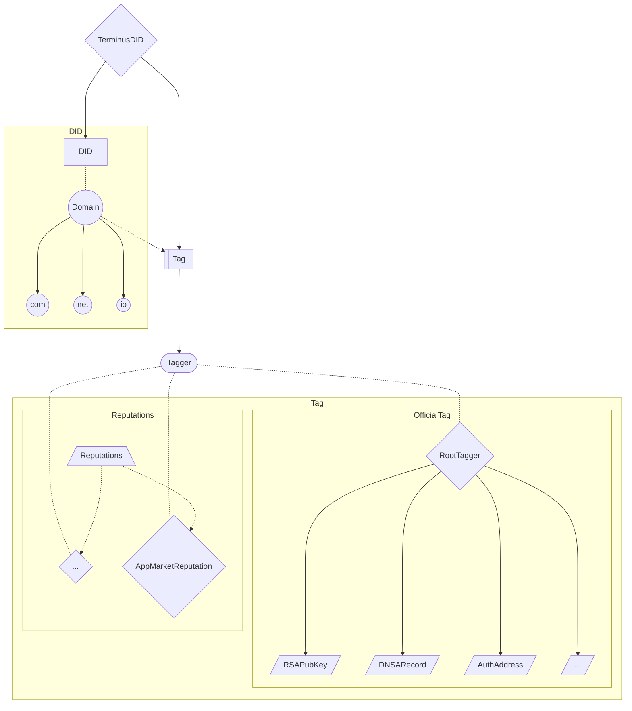

# TerminusDID Contract System

## Architecture

The TerminusDID Contract System is divided into two parts: DID Management and Tag Management. In addition to the core functions for Tag Management, we also implemented an official tagger and reputation system.

Refer [here](./contract.md) for the usage of DID/Tag Management, [here](././did/design.md) for design details of the TerminusDID contract, [here](./contract-reputation.md) for recommended implementations and examples of the reputation system.

## Design Details

### Multicall

Considering the complexity and the uncertainty of usage scenarios of our contracts, we add built-in multicall function to simplify on-chain interaction. You can access multiple interfaces in one transaction without external helper contracts.

Considering the complexity and uncertainty of usage scenarios of our contracts, we have added a built-in multicall function to simplify on-chain interactions. You can access multiple interfaces in one transaction without external contracts.

### EIP-7201

We follow EIP-7201 for contract data storage, which makes it easier and safer for contract upgrade and also facilitates granular control of data.

### Validation of Olares ID

Olares ID is submitted as a `string` type during registration. Although it is split by `.` for level separation, this cannot guarantee its correctness and readability. We implemented additional validation in contract code to ensure the submitted names are UTF-8-encoded readable strings.

### Field Names of Structs in Tags

For gas efficiency, if there are structs in a tag type, their field names are published on-chain using Ethereum events without contract storage. The events will record the block height at which the tag type is defined. Use the block height, contract address, event signature and Bloom filters to get the desired event precisely.

### Inline Assembly

We use slice types based on inline assembly to parse and traverse Olares ID levels, which can prevent copying substrings and reduce gas.

## Appendix - Requirements

### DID

- on-chain [DID](https://www.w3.org/TR/did-core/) management (prefer EVM-compatible chains)
- recording IPv4/IPv6, avatar, RSA public key etc. for DIDs
- extending stored data for possible new needs in the future

### Olares ID

- distinguishing between two kinds of DIDs for Olares ID: Organization or Individual
- derived DID management privilege for parent Organization

### Reputation

DIDs with another kind called Entity to represent real-world objects (e.g. app versions for App Market Reputation and complaints for Otmoic Reputation)

:::tip Tips
We hope to design a decentralized credit system based on DID contracts. At first we imagined a general system adaptable to various scenarios, but with its gradually implementation we found this large and comprehensive system to bring much unnecessary resource consumption and reduce flexibility in different scenarios. So we changed the direction: we present a Reputation system for abstraction and necessary components and provide some recommended implementations. Users can assembly and customize the implementation to satisfy their own scenarios.
:::
