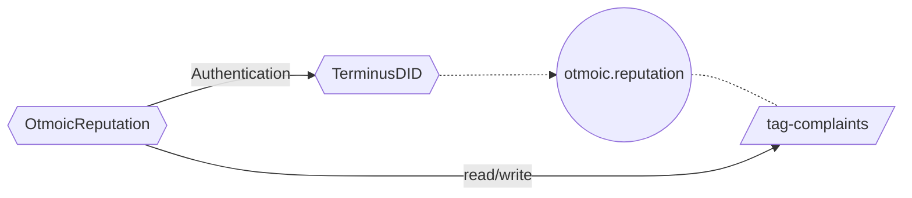
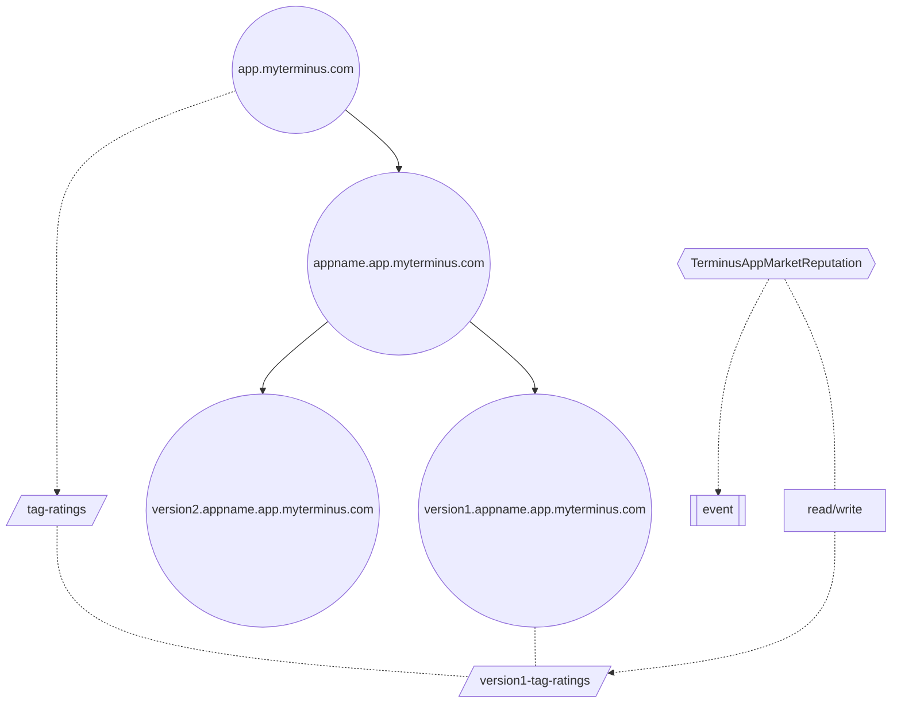

# Reputation

#### Extra requirements: Abstract Reputation System

:::info Required features

- identifiers that map to real-world objects
  All credit systems are based on some specific scenarios, e.g. reviews for an app or complaints for a merchant. This inevitably needs us to build unique on-chain identifiers for some real-world or abstract objects.

- authentication
  The most core function of the credit system is reviewing and reviewer authentication is one of its prerequisites.

- storage of necessary information
  After user reviewing, we may need to record the comments or calculate some weighted statistical data.

- recording of history and updating
  Under some circumstances, we may need to record the behavior of reviewing and allow updating existing reviews in the future.
  :::

The corresponding solution for each requirement is provided in this chapter.

## Objects to be Reviewed

For the objects to be reviewed, the following two situations may occur:

- it's a merchant or a single person
  In this case the object must have a DID of kind Individual, so we can operate the object directly without creating other DIDs.
- it's a real-world object or abstract concept
  In this case we need to first create a DID of kind Entity for this object and then operate on it.

## Authentication

There are two solutions for authentication:

- Use the owner of the DID to submit tx and let the tagger call interfaces of the Terminus DID contract for authentication.
- Use the owner of the DID to sign a customized EIP-712 message and use a forwarder to send tx on-chain. The tagger will use the message signer for authentication.

> [!NOTE] Tips
> We recommend the second solution as the transaction fee is paid by forwarders instead of reviewers.

## Storage of Necessary Information

For DIDs of kind Entity, we define tags of this DID itself and write necessary data to them. For DIDs of kind Individual, we abstract the scenario as a DID of kind Entity and write to its tags.

## Recording of History and Updating

We can follow the advice in the above section and store data in tags of Entity. But on-chain querying is not required in some scenarios, where on-chain storage is a waste. For those cases we recommend to use Ethereum events for recording and customize the detailed implementation in taggers.

## Example - OtmoicReputation

:::info

The Otmoic Reputation contract uses EIP-712 signature of DID owners for authentication and stores the `bidid` of the complained bid in the `complaints` tag of Entity `otmoic.reputation`.
:::

## Example - TerminusAppMarketReputation

:::info

The Olares App Market Reputation contract also uses EIP-712 signature of DID owners for authentication. Rating data of the contract is stored in the `ratings` tag of Entity `<version>.<appname>.app.myterminus.com`, and comment data is published in the form of Ethereum events instead of storing on-chain.
:::
