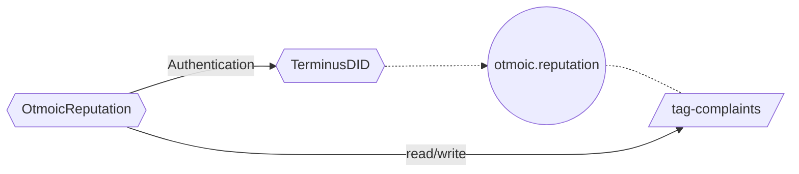
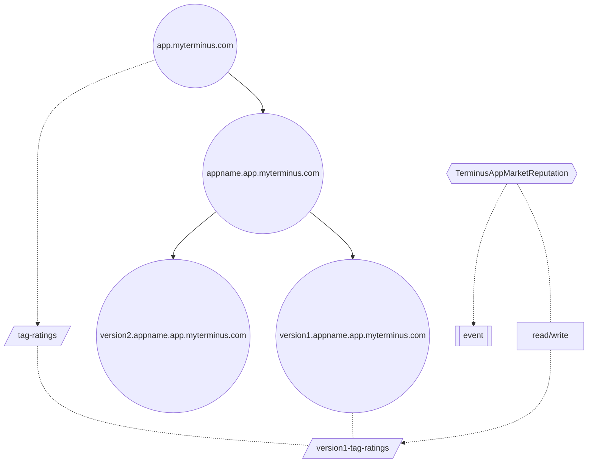

# Smart Contract

Snowinning Protocol's smart contract has two parts.

- [TerminusDID](https://github.com/beclab/terminusdid-contract-system/blob/main/src/core/TerminusDID.sol) contract plays a crucial role as the [DID Registry](/manual/concepts/registry.md). Learn more in [the contract](https://optimistic.etherscan.io/address/0x5da4fa8e567d86e52ef8da860de1be8f54cae97d).
- Third-party protocols that extend the reputation system based on [TerminusDID](https://github.com/beclab/terminusdid-contract-system/blob/main/src/core/TerminusDID.sol). Currently, the following reputation protocols are in place:
  - [Otmoic Trader Reputation](https://github.com/otmoic/reputation-contract-evm/blob/main/contracts/Reputation.sol). Learn more in [the contract](https://optimistic.etherscan.io/address/0x3179CE5fAB68C0286Da85f3d61BcE7116815e799).
  - [Application Reputation](https://github.com/beclab/terminusdid-contract-system/blob/main/src/taggers/TerminusAppMarketReputation.sol). Learn more in [the contract](https://optimistic.etherscan.io/address/0x08065353D266121938B93D4B1071Bb52CD0C0EE4).


- The [TerminusDID](https://github.com/beclab/terminusdid-contract-system/blob/main/src/core/TerminusDID.sol) contract plays a crucial role, and it serves as the [DID Registry](/manual/concepts/registry.md). View [the contract](https://optimistic.etherscan.io/address/0x5da4fa8e567d86e52ef8da860de1be8f54cae97d).
- Third-party protocols can extend the reputation based on [TerminusDID](https://github.com/beclab/terminusdid-contract-system/blob/main/src/core/TerminusDID.sol). Currently, the following reputation protocols are in place:
  - [Otmoic Trader Reputation](https://github.com/otmoic/reputation-contract-evm/blob/main/contracts/Reputation.sol). View [the contract](https://optimistic.etherscan.io/address/0xE924F7f68D1dcd004720e107F62c6303aF271ed3).
  - [Application Reputation](https://github.com/beclab/terminusdid-contract-system/blob/main/src/taggers/TerminusAppMarketReputation.sol). View [the contract](https://optimistic.etherscan.io/address/0x08065353D266121938B93D4B1071Bb52CD0C0EE4).


# TerminusDID

The TerminusDID contract manages a hierarchical structure derived from [Domain](/manual/concepts/olares-id.md#domain-types.


## Node

Each node possesses several default attributes.

| Attribute      | Description                                                                                                                                                                                                                                                                                                                                                                                                            |
| -------------- |------------------------------------------------------------------------------------------------------------------------------------------------------------------------------------------------------------------------------------------------------------------------------------------------------------------------------------------------------------------------------------------------------------------------|
| name           | Specifies the [Domain Name](/manual/concepts/olares-id.md#domain-types). Certain Domain Names can interchange with Terminus Names                                                                                                                                                                                                                                                                                      |
| id             | Each node is also a NFT, adhering to the **ERC-721** standard. Its id serves as the unique identifier for this NFT, computed through `keccak256(name)`                                                                                                                                                                                                                                                                 |
| did,owner      | The `owner` and `did` of the node, derived from the same mnemonic words. Further details on this can be found [here](/manual/concepts/did.md).<br>. Additionally, storing owner is advantageous because it complies with the **BIP44** specification, facilitating gas-efficient signature verification within EVM contracts. Each node is affiliated with an `owner`, who holds the authority to modify node details. |
| note           | Currently, there are three types: Individual, Organization, and Entity                                                                                                                                                                                                                                                                                                                                                 |
| allowSubdomain | Indicates whether it is a leaf node. If False, the node cannot spawn further nodes.                                                                                                                                                                                                                                                                                                                                    |

The following is an illustrative example that specifies the default attributes of a node:

```json
{
  "id": "0xbf90de759829bfa3d2b10e4c4a7101e3b116f70b9a5431951ff9d83a4c8e3ceb",
  "name": "olivia.myterminus.com",
  "did": "did:key:z6MkuhT5kYegHaJxirMaHxuqzJhGZk5r32Ct5nYVRQWpN31q",
  "note": "Individual",
  "owner": "0x1404C95b2Cb2E46E03650bc02f83364A92f8DA9D",
  "allowSubdomain": true
}
```

## Owner

Ownership of different nodes is as follows:

- **System**<br>
  Abstract nodes such as `root`, `com`, `io` belong to the Terminus team.

- **Individual** <br> 
  `myterminus.com` belongs to the [Individual Domain](/manual/concepts/olares-id.md#domain-types), owned by the Terminus team.  
  `alice.myterminus.com` and `bob.myterminus.com` belong to individual Terminus Names, and are owned by the respective users.

- **Organization** <br> 
  `org1.com` and `org.io` belong to the [Organization Domain](/manual/concepts/olares-id.md#domain-types), owned by the domain admin.  
  `alice.org1.com` and `bob.org2.io` belong to Organization Terminus Names, and are owned by the respective users.

- **Entity**  <br>
  The `Application Score` belongs to the [Entity Domain](/manual/concepts/olares-id.md#domain-types), and is owned by the applicant of the entity. Organization admins and users can refer to [Domain Management](../contract/manage/contract.md#register-did) to manage their own nodes and sub-nodes.

:::info
After the project stabilizes, ownership will be transferred to the multisig address of the DAO organization by the Terminus team.
:::

## Tag

The [Tag](https://github.com/beclab/terminusdid-contract-system/blob/main/src/core/TagRegistry.sol) mechanism allows the [TerminusDID](https://github.com/beclab/terminusdid-contract-system/blob/main/src/core/TerminusDID.sol) contract to extend the metadata stored on nodes.

For example, if you are an enterprise managing an organizational domain, and you want to add the attribute employee-id to each employee under the organization, you need to extend based on Tags.

Tag system allows you to freely store data types such as `uint`, `int`, `address`, `boolean`, `bytes`, `string`, `structure`, `fixed length array`, `variable length array` on-chain in a specific encoding format (ABI). Before reading or writing data, you need to define the data type. The data type you define will apply to itself and all its child nodes. The information of **definer, user, and Tag name** is used to index a unique piece of data.

:::info Note

For complex structures or arrays, as well as cases where complex structures and arrays are nested within each other, if data is written in units of Tags each time, it will result in huge useless gas consumption. Therefore, we have implemented the functionality of updating a single field or operating a single array separately in the system. When performing single updates, in addition to **definer, user, and Tag name**, you also need to provide the **path** of the data, which is the variable name inside the structure.
:::

### Customized Tags

| Field      | Description                                                                                                             |
| ---------- | ----------------------------------------------------------------------------------------------------------------------- |
| name       | Name of this tag                                                                                                        |
| did        | The DID that defines this tag                                                                                           |
| abiType    | The data type of this tag, following the encoding specifications of **abi**, also supports defining a complex structure |
| fieldNames | When defining a complex structure, the names of internal substructures or data are flattened in a two-dimensional array |


::: tip NOTE
Owner/did as a custom tag is only effective for the node and its sub nodes.
:::

### Tagger

Tagger is one of the necessary pieces of information inside each Tag. It represents the unique entity with permission to modify the Tag value, which can be a wallet address or a contract. Tagger may change frequently.


> [!NOTE]
> We recommend that you use contracts as Taggers.
>
> - Referring to the official implementations of several Taggers, you can utilize DID contracts for comprehensive operator identity authentication and also achieve more refined custom permission controls.
> - For complex Tag structures or data content with special specifications, setting the Tagger as a contract can verify the data format on-chain or establish more comprehensive custom rules. For example, for the value of RSAPubKey in the official Tag, we perform validation of bytes data in Pkcs8 ASN.1 format on-chain to prevent setting values that cannot be parsed.

## Use Cases

Some Taggers are provided under the Root node:

- RSAPubKey: Users can declare RSA public keys, and third parties can send them private messages based on this public key.
- AuthAddresses: Users can declare the wallet addresses they own.
- DNSARecord: Users can declare the DNS A records of Edge nodes.

:::info About AuthAddresses
The following systems rely on this Tag's data operation:

- Setting an Avatar

When setting an avatar in the system, you can choose any NFT image you own as an avatar. The standard for determining if you own an NFT is whether the address of the owner exists in AuthAddresses.

- Otmoic lp

Otmoic lp operates as an account with TerminusName. When signing transaction information, it verifies whether the signer's address exists in AuthAddresses.

Because AuthAddresses involve another wallet, simply verifying the sender of the transaction is not credible. Therefore, we have designed the following operation plan:

Use the declared address and DID owner to sign the following information in compliance with the EIP712 standard and submit it to the contract for verification within a limited time (30 minutes after signing).

```json
{
  "address": "0x10FE2771907B0c4245695daD7e9Ed064d45860f8",
  "algorithm": 0, // 0: ECDSA
  "domain": "olivia.myterminus.com",
  "signAt": "1714287578",
  "action": 0 //0: Add   1: Remove
}
```

:::


# Reputation

We can create highly flexible [reputation](/manual/concepts/reputation.md) protocols based on Taggers.

In implementing an on-chain Reputation system, the most crucial elements are:

- Abstracting and representing the object to be evaluated
- Evaluating the object and storing necessary information
- Authenticating the evaluator's identity

Regarding these elements, TerminusDID provides a comprehensive solution. We can use Individual and Entity types of DID to represent the object to be evaluated, use Tags to store extended metadata, and utilize TerminusDID's built-in permission management features to verify identities. Learn more in the following two cases.

## Otmoic Trader Reputation

Otmoic's reputation contract uses DID owner's EIP712 signature for identity verification, and then stores the complain did in the `complaints` field of the `otmoic.reputation` Entity.

:::info Deployment

1. Create the entity`otmoic.reputation` in the TerminusDID contract.
2. Define a Tag named complaints.
3. Deploy Otmoic Trader Reputation [contract](https://optimistic.etherscan.io/address/0xE924F7f68D1dcd004720e107F62c6303aF271ed3)
4. Set the Tagger of complaints to Otmoic Trader Reputation.
   :::

:::info Usage

1. Use DID owner to sign the transaction info following EIP712
2. Submit transaction info and signature to Otmoic Trader Reputation
   :::

:::info Structure


:::

## Application Reputation

1. Define the Tag named `ratings` and set Tagger as the Application Reputation contract
2. When there is a new version for an app, create **`<version>.<appname>.app.myterminus.com`** on the blockchain.
3. Users sign the comment/ rating info, and submit to the Application Reputation contract.
4. The Application Reputation contract saves the rating info into Ratings of `<version>.<appname>.app.myterminus.com`, and publish the comment info in the form of event

:::info



:::
