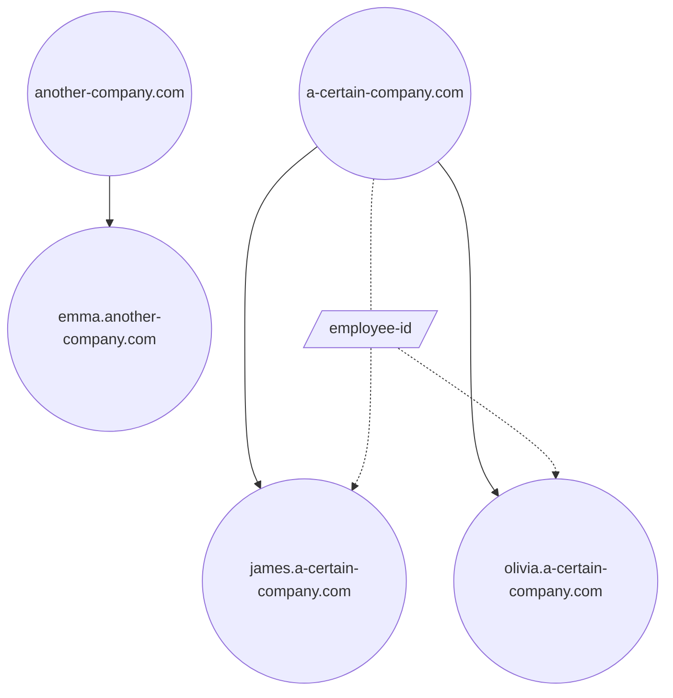

# DID

## Design of DID

### Data Contained in DIDs

#### id

Each DID is also a NFT (following **ERC-721** standard) and `id` is its unique identifier calculated by `keccak256(name)`.

#### did
Derived from mnemonic phrases, used for authentication in systems relying on DIDs.

#### owner

Also derived from mnemonic phrases (following **BIP-44** standard) and used for authentication (mostly on-chain contracts).

#### note

DIDs have the following kinds for now:

- Individual
- Organization
- Entity

:::info Naming rules of TName
A valid label of TName, i.e. each part separated by `.`:

- is a well-formed non-empty UTF-8 sequence; and
- contains only Unicode code points in category L, M, N, P, S; and
- does not contain Unicode code points in the following ranges:
  - Full Stop (U+002E)
  - Mongolian Free Variation Selectors (U+180B..U+180D)
  - Variation Selectors (U+FE00..U+FE0F)
  - Replacement Characters (U+FFFC..U+FFFD)
  - Variation Selectors Supplement (U+E0100..U+E01EF).
- is case-sensitive, e.g. `MAX.com` and `max.com` are different TNames.
- supports multiple characters including Chinese, e.g. `博物馆.中国`
  Ref: https://www.compart.com/en/unicode/category
  :::


### Tag System

In addition to basic data, we hope to maintain some states or information in DIDs. That's why we implemented the tag system.

#### how to use

1. Define a tag
2. Write to the tag

> [!NOTE]
> The definition and structure of tags are complicated. Refer to the technical details of the contract if you are interested.
> Here we briefly introduce the information in a tag definition.
>
> - name: the name of this tag
> - did: the DID that defines this tag
> - abiType: the data type of this tag, which follows the Solidity ABI specification and supports complicated structures
> - fieldNames: the field names of structs inside this tag, flatten as a 2D string array using pre-order traversal

#### the scope of tags

Every tag is only applicable to the DID under which it was defined and its subdomains.
For example, if the tag `employeeId` was defined in DID `a-certain-company.com`. Its subdomain `james.a-certain-company.com` can set `employeeId` value to `"001"` for itself. If the DIDs who have neither defined the tag nor is a subdomain of the definer, e.g. `another-company.com` and `emma.another-company.com`, cannot set the tag value.



#### taggers

The tagger is part of necessary information in each tag. Unlike the fixed definition, taggers can be changed.
A tagger represents the only person or program that has the authority to modify the tag value. It can be a wallet address or smart contract.

> [!NOTE]
> We recommend you to use smart contracts for taggers.
>
> - You can utilize the Terminus DID contract for complete operator authentications, while achieving more fine-grained custom access control. Please refer to some official tagger implementations.
> - For complicated tag structures or data with special formats, using contract taggers supports verifying data format on chain and customizing the rules. For example, in the official tagger we will verify the bytes data in PKCS8 ASN.1 format on chain to prevent accidentally setting unparsable values for the `RSAPubKey` tag.

### Who to Create DIDs

Since not everyone has enough gas for on-chain operations and is willing to use the owner address of existing DIDs, we offer the choice of sending tx by official forwarders on your behalf. Of couse you can also operate on your own if willing.

### Priviledges of DIDs

A DID has management priviledge over itself and all its subdomains. For 3rd-level domains which is registered directly, e.g. `a.b.c` without the registration of `b.c`, the owner of `b.c` will be set to `0x0...00d1d` and it is managed by the official.

### Introduction to processes and concepts

The extended information of TNames is managed by the tag system of the Terminus DID contract. Every tag has not only a name but also a tag type. For now, supported types include `int`, `uint`, `bool`, `string`, `address`, `bytes`, `bytesN`, `array`, `arrayN` and `tuple`. Tuples supports additional field names.
Since tags are bound to TNames, the steps for setting a tag are:

- Define a tag in a TName with the tag name, tag type and field names in tuples. Setting the field names is not trivial so refer to the documentation "DIDv2.3Tag 类型注册流程介绍" for details.

Code example

```Solidity
function defineTag(
    string calldata domain,
    string calldata name,
    bytes calldata abiType,
    string[][] calldata fieldNames
) public
```

- Set the tagger which is responsible for setting this tag. The tagger can be EOA or a contract address. Complicated validation logic can be implemented in contract taggers.

Code example

```Solidity
function setTagger(string calldata domain, string calldata name, address tagger) public
```

- Next you can perform CRUD of this tag on the definer and its subdomains.

```Solidity
function addTag(string calldata from, string calldata to, string calldata name, bytes calldata value) public
function removeTag(string calldata from, string calldata to, string calldata name) public
function getTagElem(string calldata from, string calldata to, string calldata name, uint256[] calldata elemPath)
    public
    view
returns (bytes memory)
function updateTagElem(
    string calldata from,
    string calldata to,
    string calldata name,
    uint256[] calldata elemPath,
    bytes calldata value
) public
function getTagElemLength(
    string calldata from,
    string calldata to,
    string calldata name,
    uint256[] calldata elemPath
) public view returns (uint256)
function pushTagElem(
    string calldata from,
    string calldata to,
    string calldata name,
    uint256[] calldata elemPath,
    bytes calldata value
) public
function popTagElem(string calldata from, string calldata to, string calldata name, uint256[] calldata elemPath) public
```

Among these

- `from` is the TName that defines this tag
- `to` is the TName to set this tag
- `name` is the tag name
- `value` is the bytes value after `abi.encode`
- `elemPath` is provided for `array` and `tuple` to access a single element. For other types just set it to an empty array. Its value is treated like indices of multi-dimensional arrays (think `tuple`s as arrays too). For example, the following type `Student` has 4-level nested tuples, and we can set `elemPath` to `[1,2,1,0,0]` to read or update `Student s -> Class class -> Teacher[1] teachers -> People info -> string name`. Note that we only have 4-level nested tuples but `elemPath` has length 5 because `teachers` is an array and adds another nesting level.

```Solidity
struct Student {
    People info;
    Class class;
}

struct Class {
    uint8 grade;
    uint8 classNum;
    Teacher[] teachers;
}

struct People {
    string name;
    uint8 age;
    string gender;
}

struct Teacher {
    People info;
    string subject;
}
Student s;
```

- The Terminus DID contract provides a set of special tags, known as the official tags. It is defined in the empty TName `""` and its tagger is specified as the `RootTagger`. All TNames can set official tags and we'll introduce the detailed access control policy later.

### Access Control of Tags

1. Defining tags in a TName, i.e. setting the tag name and type

- Official tags: the `operator` has permission
- Other tags: the owner of this TName has permission
  Defining tags can fail in the following situations:
- A tag name can only be defined once in one TName, no duplicates
- Tag names and field names of tuples must start with [a-z] and only contain [a-zA-Z0-9]
- The bytes representation of a tag type cannot exceed length 31
- The tag type must follow the type constraints in the `ABI` library
- The value of `fieldNames` must match tuple types in the definition
- A tuple cannot have duplicate field names

2. Setting the tagger:

- Official tags: the `operator` has permission
- Other tags: the owner of this TName has permission

3. Setting the tag:

   Taggers are responsible for access control of setting tags. Next we introduce the cases of official tags.

## Registration Rules and Access Control

From the contract's perspective, for now only the operator can register top-level TName. Normal registration is done by calling the `register` interface with arguments including the owner of the TName and some metadata. The metadata is immutable after registration. Sub-TNames can be registered by the operator or the owner of one of its parent TNames.
That said, registration can only be performed by the following roles:

- The `operator` of the contract
- The owner of a parent TName can register a sub-TName
  Registration can fail in the following cases:
  - when TName is not top-level: the parent TName is not registered yet or the parent's metadata specifies it cannot have sub-TNames
  - the TName contains an invalid label
  - the TName is already registered
  - the owner of the TName is specified as zero address

**Code example**:

```Solidity
struct Metadata {
string domain;
string did;
string notes;
bool allowSubdomain;
}

function register(address tokenOwner, Metadata calldata metadata) public returns (uint256 tokenId)
```

After registration, the contract will mint a ERC-721 NFT with a returned token ID (`tokenId`). It is the Keccak-256 hash of the TName string.

**Code example**:

```Solidity
function tokenId(string memory domain) internal pure returns (uint256) {
return uint256(keccak256(bytes(domain)));
}
```

Since the NFT is ERC721-compatible, it supports standard ERC-721 operations like `transferFrom` and `approve`. So the ownership can be transferred by these addresses:

- the owner of the TName
- the delegator of the owner
- addresses approved by the owner

The Terminus DID contract adds two addresses that have transfer privilege:

- `operator` of the contract
- the owner of the parent TName

## Roles of the Contract

The Terminus DID contract has an owner for upgrading itself. It also has a superuser, i.e. the `operator`, to facilitate configuration. Every TName has its owner.  

The privileges of the contract owner include:

- setting the operator address
- transferring ownership of the contract
- upgrading the contract
