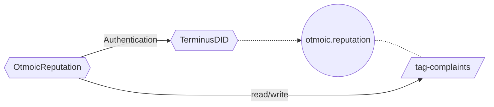
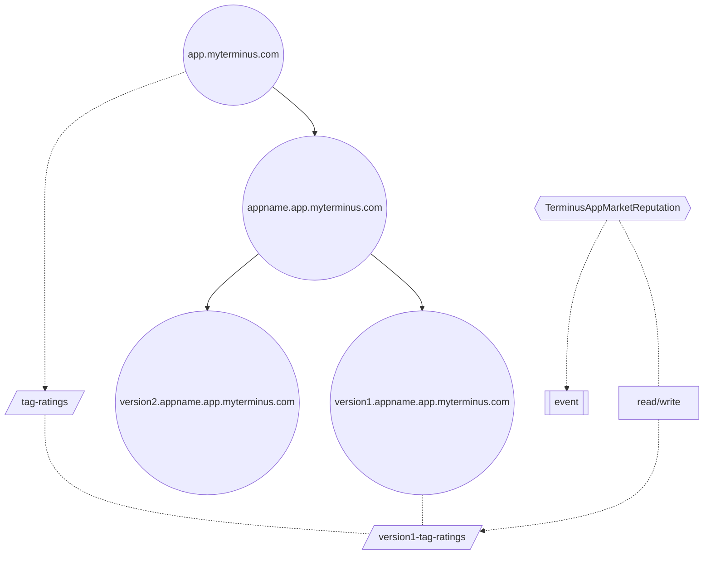

# 智能合约

Olares ID 的智能合约包含两个部分。

- [TerminusDID](https://github.com/beclab/terminusdid-contract-system/blob/main/src/core/TerminusDID.sol) 合约扮演着关键角色，并作为 [DID Registry (DID 注册表)](https://www.google.com/search?q=/manual/concepts/registry.md)。查看[合约](https://optimistic.etherscan.io/address/0x5da4fa8e567d86e52ef8da860de1be8f54cae97d)。
- 第三方协议可以基于 [TerminusDID](https://github.com/beclab/terminusdid-contract-system/blob/main/src/core/TerminusDID.sol) 扩展信誉系统。目前，已部署以下信誉协议：
    - [Otmoic Trader Reputation](https://github.com/otmoic/reputation-contract-evm/blob/main/contracts/Reputation.sol)。查看[合约](https://optimistic.etherscan.io/address/0xE924F7f68D1dcd004720e107F62c6303aF271ed3)。
    - [Application Reputation](https://github.com/beclab/terminusdid-contract-system/blob/main/src/taggers/TerminusAppMarketReputation.sol)。查看[合约](https://optimistic.etherscan.io/address/0x08065353D266121938B93D4B1071Bb52CD0C0EE4)。

# TerminusDID

TerminusDID 合约管理着一个源自 [Domain (域)](https://docs.jointerminus.com/overview/terminus/terminus-name.html#domain) 的层级结构。

## 节点 (Node)

每个节点都拥有几个默认属性。

| 属性             | 描述                                                                                                                                                                                                          |
| ---------------- |-------------------------------------------------------------------------------------------------------------------------------------------------------------------------------------------------------------|
| name             | 指定[域名 (Domain Name)](/zh/manual/concepts/olares-id#域名类型)。某些域名可与 Olares ID 互换。                                                                                                                               |
| id               | 每个节点也是一个遵循 **ERC-721** 标准的 NFT。其 id 是该 NFT 的唯一标识符，通过 `keccak256(name)` 计算得出。                                                                                                                                |
| did,owner        | 节点的 `owner` 和 `did`，由相同的助记词派生而来。更多详情请见[此处](https://www.google.com/search?q=/manual/concepts/did.md)。\<br\>此外，存储 owner 的好处在于它遵循 **BIP44** 规范，有助于在 EVM 合约内进行节省 Gas 的签名验证。每个节点都隶属于一个 `owner`，该 `owner` 有权修改节点详情。 |
| note             | 目前有三种类型：个人 (Individual)、组织 (Organization) 和实体 (Entity)。                                                                                                                                                     |
| allowSubdomain   | 指示其是否为叶子节点。如果为 False，该节点无法派生更多子节点。                                                                                                                                                                          |

以下是一个指定节点默认属性的示例：

```json
{
  "id": "0xbf90de759829bfa3d2b10e4c4a7101e3b116f70b9a5431951ff9d83a4c8e3ceb",
  "name": "olivia.myterminus.com",
  "did": "did:key:z6MkuhT5kYegHaJxirMaHxuqzJhGZk5r32Ct5nYVRQWpN31q",
  "note": "Individual",
  "owner": "0x1404C95b2Cb2E46E03650bc02f83364A92f8DA9D",
  "allowSubdomain": true
}
```

## 所有者 (Owner)

不同节点的所有权如下：

- **系统 (System)**\<br\>
  诸如 `root`、`com`、`io` 等抽象节点属于 Terminus 团队。

- **个人 (Individual)** \<br\>
  `myterminus.com` 属于[个人域 (Individual Domain)](/zh/manual/concepts/olares-id.md#域名类型)，由 Terminus 团队所有。
  `alice.myterminus.com` 和 `bob.myterminus.com` 属于个人 Terminus 名称，由各自的用户所有。

- **组织 (Organization)** \<br\>
  `org1.com` 和 `org.io` 属于[组织域 (Organization Domain)](/zh/manual/concepts/olares-id.md#域名类型)，由域管理员所有。
  `alice.org1.com` 和 `bob.org2.io` 属于组织 Terminus 名称，由各自的用户所有。

- **实体 (Entity)** \<br\>
  `Application Score` 属于[实体域 (Entity Domain)](/zh/manual/concepts/olares-id.md#域名类型)，由该实体的申请人所有。组织管理员和用户可以参考[域管理](https://www.google.com/search?q=../contract/manage/contract.md%23register-did)来管理他们自己的节点和子节点。

:::info
项目稳定后，Terminus 团队会将所有权转移给 DAO 组织的多签地址。
:::

## 标签 (Tag)

[Tag (标签)](https://github.com/beclab/terminusdid-contract-system/blob/main/src/core/TagRegistry.sol) 机制允许 [TerminusDID](https://github.com/beclab/terminusdid-contract-system/blob/main/src/core/TerminusDID.sol) 合约扩展节点上存储的元数据。

例如，如果你是一家管理组织域的企业，并希望为组织下的每位员工添加 `employee-id` (员工ID) 属性，你就需要基于标签进行扩展。

标签系统允许你以特定的编码格式 (ABI) 在链上自由存储 `uint`、`int`、`address`、`boolean`、`bytes`、`string`、`structure`、`fixed length array`、`variable length array` 等数据类型。在读写数据之前，你需要定义数据类型。你定义的数据类型将适用于其自身及其所有子节点。**定义者 (definer)、使用者 (user) 和标签名 (Tag name)** 的信息用于索引一条唯一的数据。

:::info 注意

对于复杂结构或数组，以及复杂结构和数组相互嵌套的情况，如果每次都以标签为单位写入数据，将会导致巨大的无效 Gas 消耗。因此，我们在系统中实现了单独更新单个字段或操作单个数组的功能。在执行单次更新时，除了**定义者、使用者和标签名**之外，你还需要提供数据的**路径 (path)**，即结构体内部的变量名。
:::

### 自定义标签

| 字段         | 描述                                                                       |
| ------------ | -------------------------------------------------------------------------- |
| name         | 此标签的名称                                                               |
| did          | 定义此标签的 DID                                                           |
| abiType      | 此标签的数据类型，遵循 **abi** 的编码规范，也支持定义复杂结构              |
| fieldNames   | 定义复杂结构时，内部子结构或数据的名称在一个二维数组中被扁平化             |

:::tip 注意
作为自定义标签的 Owner/did 仅对该节点及其子节点有效。
:::

### Tagger

Tagger 是每个标签内部的必要信息之一。它代表有权修改标签值的唯一实体，可以是一个钱包地址或一个合约。Tagger 可能会频繁更改。

::: tip Note
我们建议你使用合约作为 Tagger。

- 参考几个官方 Tagger 的实现，你可以利用 DID 合约进行全面的操作者身份验证，同时实现更精细的自定义权限控制。
- 对于复杂的标签结构或具有特殊规范的数据内容，将 Tagger 设置为合约可以在链上验证数据格式或建立更全面的自定义规则。例如，对于官方标签中 RSAPubKey 的值，我们在链上对 Pkcs8 ASN.1 格式的字节数据进行验证，以防止设置无法解析的值。
:::

## 使用案例

在根 (Root) 节点下提供了一些 Tagger：

- RSAPubKey: 用户可以声明 RSA 公钥，第三方可以基于此公钥向他们发送私密消息。
- AuthAddresses: 用户可以声明他们拥有的钱包地址。
- DNSARecord: 用户可以声明边缘节点的 DNS A 记录。

:::info 关于 AuthAddresses
以下系统依赖于此标签的数据操作：

- **设置头像**

  在系统中设置头像时，你可以选择你拥有的任何 NFT 图片作为头像。判断你是否拥有某个 NFT 的标准是其所有者的地址是否存在于 AuthAddresses 中。

- **Otmoic lp**

  Otmoic lp 以 TerminusName 作为账户进行操作。在签署交易信息时，它会验证签名者的地址是否存在于 AuthAddresses 中。

因为 AuthAddresses 涉及另一个钱包，仅验证交易的发送者是不可信的。因此，我们设计了以下操作方案：

使用声明的地址和 DID 所有者，遵循 EIP712 标准签署以下信息，并在限定时间内（签署后30分钟内）提交给合约进行验证。

```json
{
  "address": "0x10FE2771907B0c4245695daD7e9Ed064d45860f8",
  "algorithm": 0, // 0: ECDSA
  "domain": "olivia.myterminus.com",
  "signAt": "1714287578",
  "action": 0 // 0: Add   1: Remove
}
```

:::

# 信誉 (Reputation)

我们可以基于 Tagger 创建高度灵活的[信誉](https://www.google.com/search?q=/manual/concepts/reputation.md)协议。

在实现链上信誉系统时，最关键的要素是：

- 抽象和表示待评估的对象
- 评估对象并存储必要信息
- 验证评估者的身份

针对这些要素，TerminusDID 提供了一套全面的解决方案。我们可以使用个人 (Individual) 和实体 (Entity) 类型的 DID 来代表待评估的对象，使用标签 (Tags) 来存储扩展的元数据，并利用 TerminusDID 内置的权限管理功能来验证身份。在以下两个案例中了解更多信息。

## Otmoic Trader Reputation

Otmoic 的信誉合约使用 DID 所有者的 EIP712 签名进行身份验证，然后将投诉的 DID (complain did) 存储在 `otmoic.reputation` 实体的 `complaints` 字段中。

:::info 部署

1.  在 TerminusDID 合约中创建实体 `otmoic.reputation`。
2.  定义一个名为 `complaints` 的标签。
3.  部署 Otmoic Trader Reputation [合约](https://optimistic.etherscan.io/address/0xE924F7f68D1dcd004720e107F62c6303aF271ed3)。
4.  将 `complaints` 的 Tagger 设置为 Otmoic Trader Reputation。
    :::

:::info 用法

1.  使用 DID 所有者遵循 EIP712 签署交易信息。
2.  将交易信息和签名提交给 Otmoic Trader Reputation。
    :::

:::info 结构

:::

## 应用声誉

1.  定义名为 `ratings` 的标签，并将其 Tagger 设置为 Application Reputation 合约。
2.  当应用有新版本时，在区块链上创建 **`<version>.<appname>.app.myterminus.com`**。
3.  用户签署评论/评分信息，并提交给 Application Reputation 合约。
4.  Application Reputation 合约将评分信息保存到 `<version>.<appname>.app.myterminus.com` 的 Ratings 中，并以事件 (event) 的形式发布评论信息。

:::info

:::