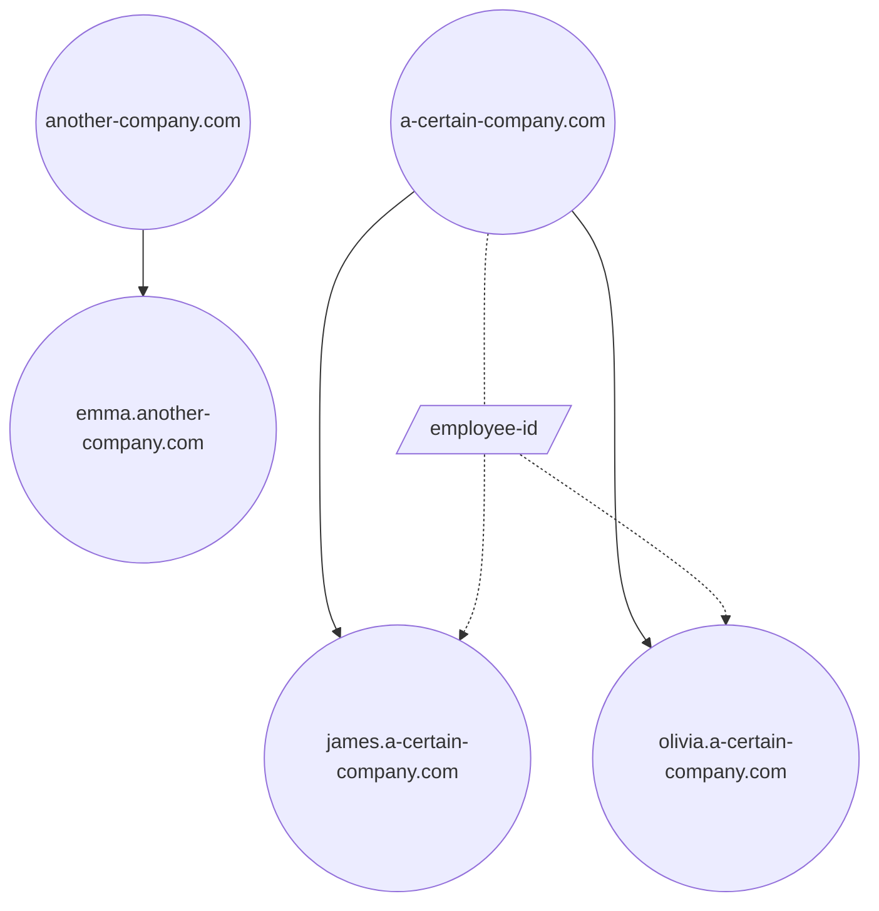

# DID

## DID 的设计

### DID 中包含的数据

#### id

每个 DID 同时也是一个 NFT（遵循 **ERC-721** 标准），`id` 是通过 `keccak256(name)` 计算得出的其唯一标识符。

#### did

由助记词派生而来，用于依赖 DID 的系统中的身份验证。

#### owner

同样由助记词派生（遵循 **BIP-44** 标准），用于身份验证（主要是在链上合约中）。

#### note

DID 目前有以下几种类型：

- 个人 (Individual)
- 组织 (Organization)
- 实体 (Entity)

:::info TName 的命名规则
一个有效的 TName 标签，即由 `.` 分隔的每个部分：

- 是格式良好且非空的 UTF-8 序列；且
- 仅包含 Unicode 编码类别为 L, M, N, P, S 的码点；且
- 不包含以下范围内的 Unicode 码点：
  - 句号 (Full Stop) (U+002E)
  - 蒙古文自由变体选择符 (Mongolian Free Variation Selectors) (U+180B..U+180D)
  - 变体选择符 (Variation Selectors) (U+FE00..U+FE0F)
  - 替换字符 (Replacement Characters) (U+FFFC..U+FFFD)
  - 变体选择符补充 (Variation Selectors Supplement) (U+E0100..U+E01EF)。
- 大小写敏感，例如 `MAX.com` 和 `max.com` 是不同的 TName。
- 支持包括中文在内的多种字符，例如 `博物馆.中国`
  参考: [https://www.compart.com/en/unicode/category](https://www.compart.com/en/unicode/category)
  :::

### 标签系统 (Tag System)

除了基础数据，我们希望在 DID 中维护一些状态或信息。这就是我们实现标签系统的原因。

#### 如何使用

1.  定义一个标签
2.  向标签写入数据

:::tip 注意
标签的定义和结构很复杂。如果你感兴趣，请参阅合约的技术细节。
这里我们简要介绍一个标签定义中包含的信息。

 - name: 此标签的名称
 - did: 定义此标签的 DID
 - abiType: 此标签的数据类型，遵循 Solidity ABI 规范并支持复杂结构
- fieldNames: 此标签内部结构体的字段名，使用前序遍历扁平化为二维字符串数组
:::

#### 标签的作用域

每个标签仅适用于定义它的 DID 及其子域。
例如，如果标签 `employeeId` 是在 DID `a-certain-company.com` 中定义的，其子域 `james.a-certain-company.com` 可以为自己设置 `employeeId` 的值为 `"001"`。如果某个 DID 既没有定义该标签，也不是定义者（definer）的子域，例如 `another-company.com` 和 `emma.another-company.com`，则无法设置该标签的值。



#### Tagger

Tagger 是每个标签中的必要信息之一。与固定的定义不同，Tagger 可以被更改。
Tagger 代表唯一有权修改该标签值的个人或程序。它可以是一个钱包地址或一个智能合约。

::: tip Note
我们建议你使用智能合约作为 Tagger。

 - 你可以利用 Olares DID 合约进行完整的操作者身份验证，同时实现更细粒度的自定义访问控制。请参考一些官方的 Tagger 实现。
 - 对于复杂的标签结构或具有特殊格式的数据，使用合约 Tagger 支持在链上验证数据格式并自定义规则。例如，在官方 Tagger 中，我们将在链上验证 PKCS8 ASN.1 格式的字节数据，以防止意外为 `RSAPubKey` 标签设置无法解析的值。
:::

### 由谁创建 DID

考虑到并非每个人都有足够的 Gas 用于链上操作，并且愿意使用现有 DID 的 owner 地址，我们提供了由官方 forwarder (转发器) 为你代发交易的选项。当然，如果你愿意，也可以自己操作。

### DID 的权限

一个 DID 对其自身及其所有子域拥有管理权限。对于直接注册的三级域名，例如 `a.b.c`（在 `b.c` 未注册的情况下），`b.c` 的 owner 将被设置为 `0x0...00d1d`，并由官方管理。

### 流程与概念介绍

TName 的扩展信息由 Olares DID 合约的标签系统管理。每个标签不仅有名称，还有标签类型。目前支持的类型包括 `int`, `uint`, `bool`, `string`, `address`, `bytes`, `bytesN`, `array`, `arrayN` 和 `tuple`。元组 (tuple) 支持额外的字段名。
由于标签与 TName 绑定，设置标签的步骤如下：

- 在一个 TName 中定义一个标签，包括标签名、标签类型以及元组中的字段名。设置字段名并非易事，详情请参阅文档 "DIDv2.3Tag 类型注册流程介绍"。

代码示例

```solidity
function defineTag(
    string calldata domain,
    string calldata name,
    bytes calldata abiType,
    string[][] calldata fieldNames
) public
```

- 设置负责写入此标签的 Tagger。Tagger 可以是 EOA 或合约地址。复杂的验证逻辑可以在合约 Tagger 中实现。

代码示例:

```solidity
function setTagger(string calldata domain, string calldata name, address tagger) public
```

- 接下来，你可以在该标签的定义者及其子域上对此标签执行 CRUD 操作。

```solidity
function addTag(string calldata from, string calldata to, string calldata name, bytes calldata value) public
function removeTag(string calldata from, string calldata to, string calldata name) public
function getTagElem(string calldata from, string calldata to, string calldata name, uint256[] calldata elemPath)
    public
    view
returns (bytes memory)
function updateTagElem(
    string calldata from,
    string calldata to,
    string calldata name,
    uint256[] calldata elemPath,
    bytes calldata value
) public
function getTagElemLength(
    string calldata from,
    string calldata to,
    string calldata name,
    uint256[] calldata elemPath
) public view returns (uint256)
function pushTagElem(
    string calldata from,
    string calldata to,
    string calldata name,
    uint256[] calldata elemPath,
    bytes calldata value
) public
function popTagElem(string calldata from, string calldata to, string calldata name, uint256[] calldata elemPath) public
```

其中：

- `from` 是定义此标签的 TName
- `to` 是要设置此标签的 TName
- `name` 是标签名
- `value` 是经过 `abi.encode` 后的字节值
- `elemPath` 用于 `array` 和 `tuple` 类型，以访问单个元素。对于其他类型，只需设置为空数组。其值被视为多维数组的索引（也可以将 `tuple` 视为数组）。例如，以下 `Student` 类型有4层嵌套的元组，我们可以设置 `elemPath` 为 `[1,2,1,0,0]` 来读取或更新 `Student s -> Class class -> Teacher[1] teachers -> People info -> string name`。请注意，虽然我们只有4层嵌套的元组，但 `elemPath` 的长度为5，因为 `teachers` 是一个数组，增加了一个嵌套层级。

```solidity
struct Student {
    People info;
    Class class;
}

struct Class {
    uint8 grade;
    uint8 classNum;
    Teacher[] teachers;
}

struct People {
    string name;
    uint8 age;
    string gender;
}

struct Teacher {
    People info;
    string subject;
}
Student s;
```

- Olares DID 合约提供了一组特殊的标签，称为官方标签。它在空 TName `""` 中定义，其 Tagger 被指定为 `RootTagger`。所有 TName 都可以设置官方标签，我们稍后将介绍详细的访问控制策略。

### 标签的访问控制

1.  在 TName 中定义标签，即设置标签名和类型

  - 官方标签：`operator` (运营方) 拥有权限
  - 其他标签：此 TName 的 owner (所有者) 拥有权限
    在以下情况下，定义标签可能会失败：
  - 一个标签名在同一个 TName 中只能定义一次，不能重复
  - 标签名和元组的字段名必须以 [a-z] 开头，且只包含 [a-zA-Z0-9]
  - 标签类型的字节表示长度不能超过 31
  - 标签类型必须遵循 `ABI` 库中的类型约束
  - `fieldNames` 的值必须与定义中的元组类型匹配
  - 一个元组不能有重复的字段名

2.  设置 Tagger：

  - 官方标签：`operator` 拥有权限
  - 其他标签：此 TName 的 owner 拥有权限

3.  设置标签：

    Tagger 负责设置标签时的访问控制。接下来我们介绍官方标签的情况。

## 注册规则与访问控制

从合约的角度来看，目前只有 operator 可以注册顶级 TName。普通注册通过调用 `register` 接口完成，参数包括 TName 的 owner 和一些元数据。元数据在注册后是不可变的。子 TName 可以由 operator 或其任一父 TName 的 owner 注册。
也就是说，只有以下角色可以执行注册：

- 合约的 `operator`
- 父 TName 的 owner 可以注册一个子 TName
  在以下情况下，注册可能会失败：
  - 当 TName 不是顶级域名时：父 TName 尚未注册，或父 TName 的元数据指定其不能拥有子 TName
  - TName 包含无效的标签
  - TName 已被注册
  - TName 的 owner 被指定为零地址

**代码示例**：

```solidity
struct Metadata {
string domain;
string did;
string notes;
bool allowSubdomain;
}

function register(address tokenOwner, Metadata calldata metadata) public returns (uint256 tokenId)
```

注册后，合约将铸造一个 ERC-721 NFT，并返回一个 token ID (`tokenId`)。它是 TName 字符串的 Keccak-256 哈希值。

**代码示例**：

```solidity
function tokenId(string memory domain) internal pure returns (uint256) {
return uint256(keccak256(bytes(domain)));
}
```

由于该 NFT 与 ERC721 兼容，它支持标准的 ERC-721 操作，如 `transferFrom` 和 `approve`。因此，所有权可以由以下地址转移：

- TName 的 owner
- owner 的委托人
- 经 owner 批准的地址

Terminus DID 合约额外增加了两个拥有转移权限的地址：

- 合约的 `operator`
- 父 TName 的 owner

## 合约的角色
Olares DID 合约有一个 owner 用于升级自身。它还有一个超级用户，即 `operator`，以方便进行配置。每个 TName 都有其自己的 owner。

合约 owner 的权限包括：

- 设置 operator 地址
- 转移合约的所有权
- 升级合约